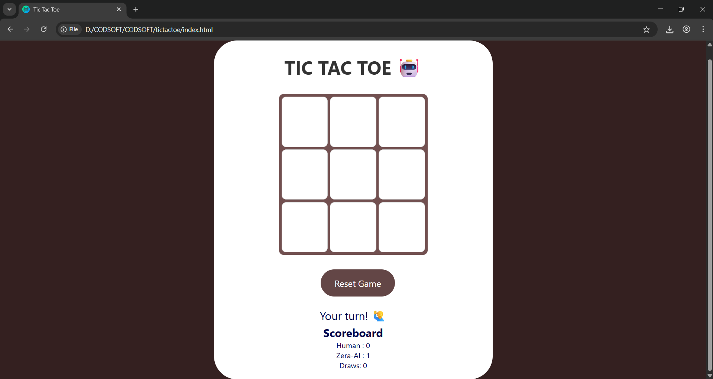

# 🎮 Tic-Tac-Toe AI — Zera Edition

A web-based Tic-Tac-Toe game where you play against an unbeatable AI powered by the **Minimax algorithm**. Built as part of **CodSoft Internship Task 2**, this app demonstrates basic game theory, front-end design, and AI strategy in action.

---

## 💻 Tech Stack

- **HTML** – Structure
- **CSS** – Styling & Animations
- **JavaScript** – Game Logic + Minimax AI

---

## 🧠 Features

- Play against an AI that **never loses** (Minimax logic)
- Real-time scoreboard (Wins, Draws)
- Responsive and interactive interface

---

## 🤖 AI Logic – Minimax

The AI uses the **Minimax algorithm** to simulate all possible moves and select the one that leads to the best outcome. It considers:
- **Maximizing its own win chances**
- **Minimizing the player's chances**
- Evaluates win, lose, and draw conditions at every depth

---

## 🧪 How to Run

1. Clone or download the repo.
2. Open `index.html` in a web browser.
3. Start playing — you go first!

---

## 📁 File Structure

├── index.html # Main game interface 
├── style.css # Game styling and animations 
├── script.js # Game logic + AI 
└── README.md # You're reading it!

---

## 📸 Screenshot

---

## 🙋‍♂️ Developer

**Asif Hussain A**  
B.Tech CSE | 3rd Year  
B.S. Abdur Rahman Crescent Institute of Science & Technology  
[LinkedIn](https://www.linkedin.com/in/asif-hussain-a-coder/) | [GitHub](https://github.com/asif-code-s)

---

## 📜 Internship

**Program:** CodSoft AI/ML Internship  
**Task 2:** Tic Tac Toe AI using Minimax  
**Month:** July 2025

---
